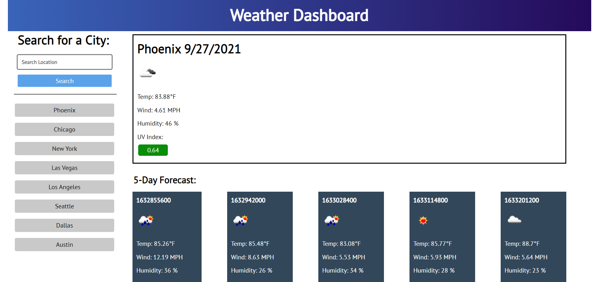

# Weather-Dashboard
## Website

https://mavila6.github.io/weather-dashboard/

## Description

A weather application for travelers used to search the weather conditions for multiple cities in order to help plan a trip accordingly.

## Table of Contents

- [Built With](#built-with)
- [Screenshot](#screenshot)
- [Acknowledgements](#acknowledgements)
- [Questions](#questions)
- [Author](#author)

### Built-With

### Screenshot

### Acknowledgements

- Collaborated with [Kama Castaneda](https://github.com/kamacasta) to complete this challenge.

- Used the [OpenWeather One Call API](https://openweathermap.org/api/one-call-api) to retrieve weather data.

- For best view of the quiz open in screens of min-width: 1462.

### Questions

If you have any questions feel free to take a look at my [GitHub](https://github.com/mavila6) or contact me at mavila6@email.arizona.edu

### Author

&copy; 2021 Marco Avila
